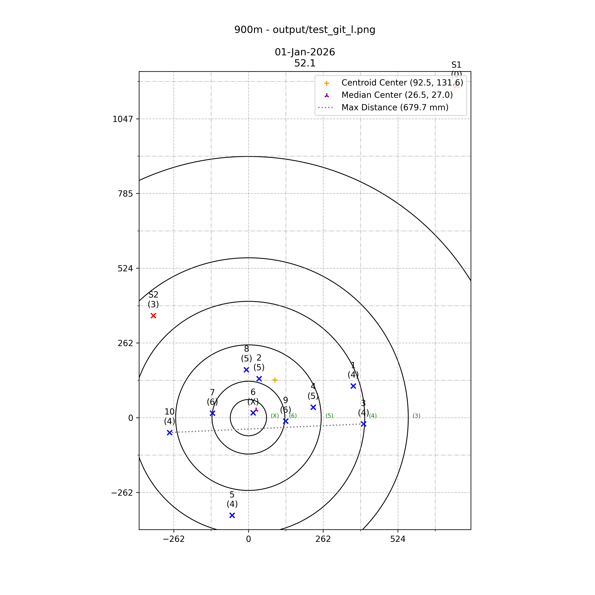
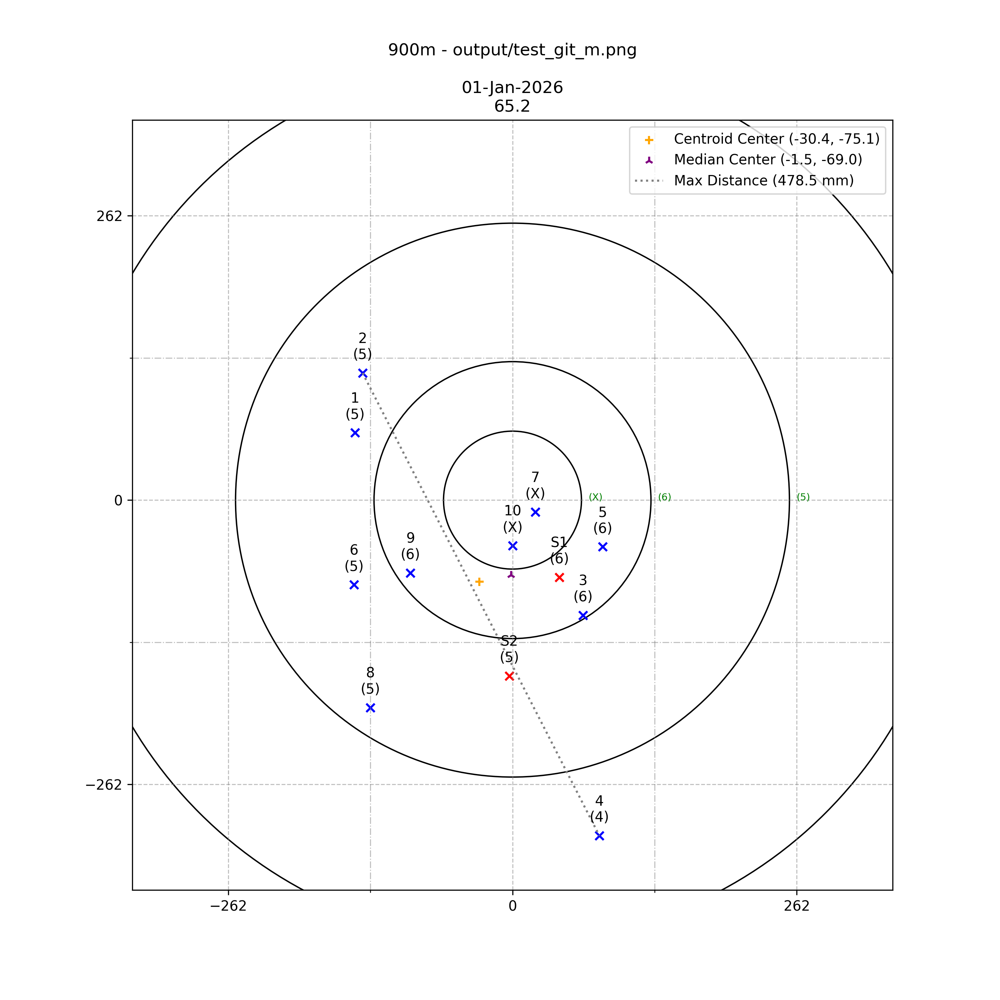

# pyPlotShotMarker

## Improved script

```bash
python3 pyPlotShotMarker.py
Usage: pyPlotShotMarker.py [-h] --prefix PREFIX --distance DISTANCE [--x X] [--y Y] filename

python3 pyPlotShotMarker.py <input csv> --prefix test1

python3 pyPlotShotMarker.py <input csv> --distance 900 --prefix test2

python3 pyPlotShotMarker.py <input csv> --distance 900 --prefix test3 --x 250 --y 250
```

Where `input csv` is a section of a ShotMarker shoot.

Ensure a directory called `output` exists.

It will then generate images with dynamic sizes but a min of -300,300 but will expand if required for a stray shot




It will calculate the extreme spread between scoring shots.

It will calculate the Centroid (math center) and Meadian (adjusting for outliers) centers

### Example input csv

```csv
time,tags,id,score,temp C,x mm,y mm
11:08.5,sighter/incomplete,RS1,4,21,231,-249
11:09.1,sighter/incomplete,MS1,6,21,43,-71
11:09.4,off/sighter/warning-measured off target top/incomplete,LS1,0,21,729,1163
11:11.2,sighter,RS2,5,20,-148,63
11:11.5,sighter/incomplete,MS2,5,20,-3,-162
11:12.3,sighter/incomplete,LS2,3,20,-333,358
11:13.3,incomplete,R1,6,20,-64,-65
11:14.1,,M1,5,20,-145,62
11:15.2,incomplete,L1,4,20,367,111
11:15.5,incomplete,R2,6,20,76,35
11:16.1,incomplete,M2,5,20,-138,117
11:16.3,incomplete,L2,5,20,37,137
11:17.3,incomplete,R3,6,20,42,56
11:18.4,,M3,6,21,65,-106
11:20.1,incomplete,L3,4,21,403,-22
11:21.4,,R4,X,21,43,-46
11:22.2,incomplete,M4,4,21,80,-309
11:23.0,,L4,5,21,227,37
11:24.2,,R5,X,21,15,28
11:24.6,,M5,6,21,83,-43
11:25.4,incomplete,L5,4,21,-57,-342
11:26.4,incomplete,R6,6,21,48,-108
11:27.3,incomplete,M6,5,21,-146,-78
11:28.5,incomplete,L6,X,21,16,17
11:29.5,incomplete,R7,5,21,58,-121
11:30.1,incomplete,M7,X,21,21,-11
11:30.5,,L7,6,21,-126,16
11:31.6,incomplete,R8,5,21,144,49
11:32.3,incomplete,M8,5,21,-131,-191
11:33.3,,L8,5,21,-7,168
11:34.5,,R9,5,20,-13,180
11:35.2,incomplete,M9,6,20,-94,-67
11:35.6,incomplete,L9,6,20,130,-12
11:36.5,incomplete,R10,6,20,9,124
11:37.3,,M10,X,20,0,-42
11:38.2,incomplete,L10,4,20,-276,-52
```