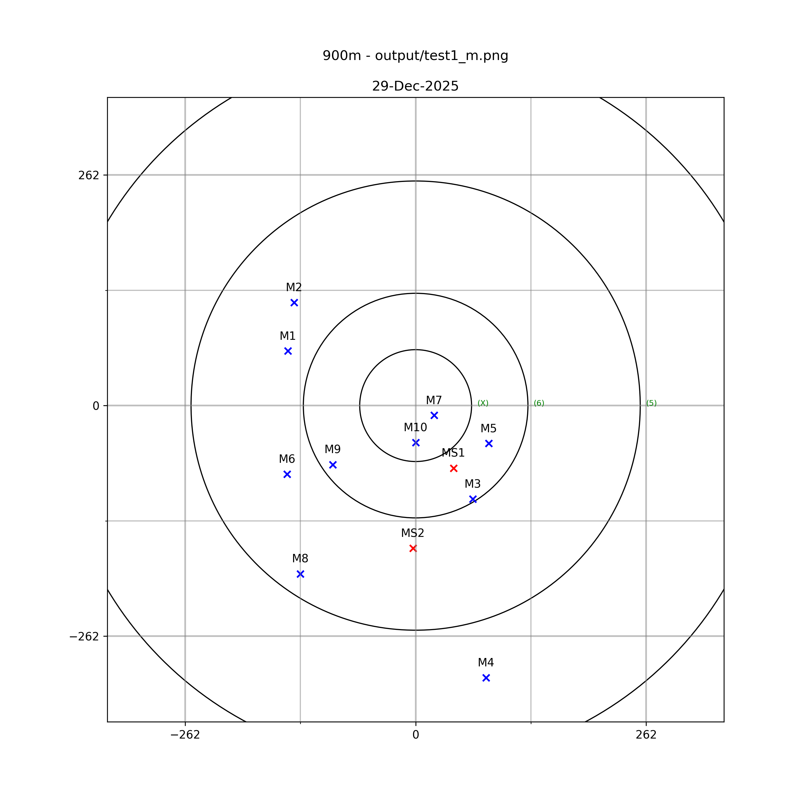
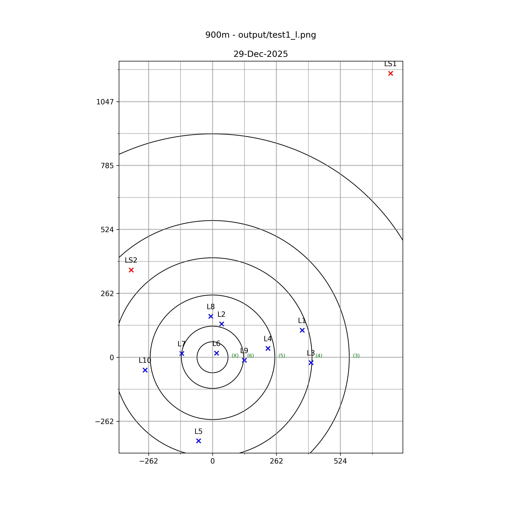

# pyPlotShotMarker

## Improved script

```shell
python3 c.py <input csv> --prefix test1
```

Where `input csv` is a section of a ShotMarker shoot.

Ensure a directory called `output` exists.

It will then generate images with dynamic sizes but a min of -300,300 but will expand if required for a stray shot




Current it is set for 900m Australian F-Class targets
